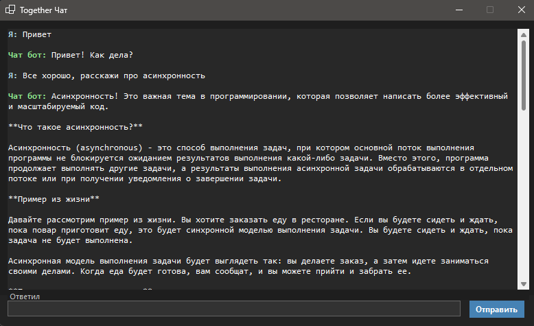

# AIChatApp
---
- Чат с нейросетью на WinForms с использованием Together AI
---
- Chat with a neural network on WinForms using Together AI
---

## О приложении
- Общение с AI
- Архитектурный проект
- Безопасная работа с API
- История в чатах(подключить можно будет)
---
## About the app
- Communication with AI
- Architectural project
- Secure work with the API
- Chat history (you can enable it)
---
## Nuget Packages
- Newtonsoft.Json
- System.Net.Http.Json
- Microsoft.Extensions.Configuration
- Microsoft.Extensions.Configuration.Json
- Microsoft.Extensions.Logging.Abstractions
- Microsoft.Extensions.DependencyInjection
---
## Установка
- Клонируем репозиторий
- Заходим в appsettings.json  меняем наш апи токен, его берем на (https://www.together.ai/)
- Запускаем приложение и пользуемся
---
## Installation
- Cloning the repository
- Go to appsettings.json we change our api token, we take it to (https://www.together.ai /)
- Launch the application and use
---
## Screen
---

---